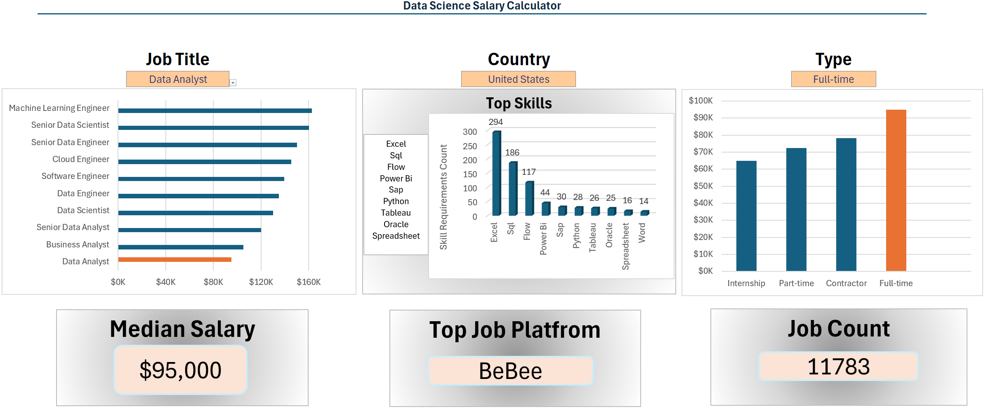

# 📊 Data Job Market Analysis (Excel Project)

## 📌 Overview
This project explores global data job postings using Microsoft Excel to uncover key trends in **salaries, required skills, and job distribution**.

As an aspiring Data Analyst, I developed this project to simulate a real-world analytical workflow — from working with raw data to delivering insights through an interactive dashboard.

---

## 📊 Dataset
The dataset used in this project was sourced from **Luke Barousse’s Data Analytics course**, utilizing data collected via the **Data Nerd web scraping tool (datanerd.tech)**.

It includes job postings from **2025**, covering various roles such as:
- Data Analyst  
- Data Scientist  
- Data Engineer  

The dataset contains information on:
- Job titles and locations  
- Salary ranges (hourly and yearly)  
- Required skills  
- Work type (remote/on-site)  
- Company-related data  

---

## 🎯 Project Scope
The main objective of this project was to perform a comprehensive **Exploratory Data Analysis (EDA)** to better understand the current state of the data job market.

Key areas of analysis included:
- Identifying the most in-demand technical skills  
- Analyzing salary distributions across roles and locations  
- Exploring the relationship between skills and compensation  
- Evaluating the presence of remote work opportunities  
- Transforming raw job posting data into structured insights  

The final outcome is an **interactive Excel dashboard** designed to make these insights accessible and easy to interpret.

---

## 🛠️ Tools & Techniques
- Microsoft Excel  
- Data Cleaning & Transformation  
- Pivot Tables & Pivot Charts  
- Data Validation  
- Dashboard Design  

---

## 📊 Key Insights
- **SQL and Excel** remain the most frequently required foundational skills  
- **Python** is strongly associated with higher-paying roles  
- **Cloud technologies (AWS, Azure)** appear less frequently but offer higher average salaries  
- Remote roles show increasing presence across data-related positions  

---

## 📈 Dashboard Preview

---

## 📂 Files
- `Dashboard.xlsx` → final interactive dashboard  
- `Full_project.xlsx` → full dataset, cleaning, and analysis process  

---

## 🚀 What I Learned
- Working with real-world datasets  
- Cleaning and structuring messy data  
- Building interactive dashboards in Excel  
- Translating data into meaningful, business-oriented insights  

---

## 🙌 Acknowledgements
- **Luke Barousse** for the data analytics course and dataset  
- **Data Nerd (datanerd.tech)** for providing the job posting data via web scraping  

---

## 📬 Contact
Feel free to connect with me on LinkedIn to discuss data analytics, projects, or opportunities.